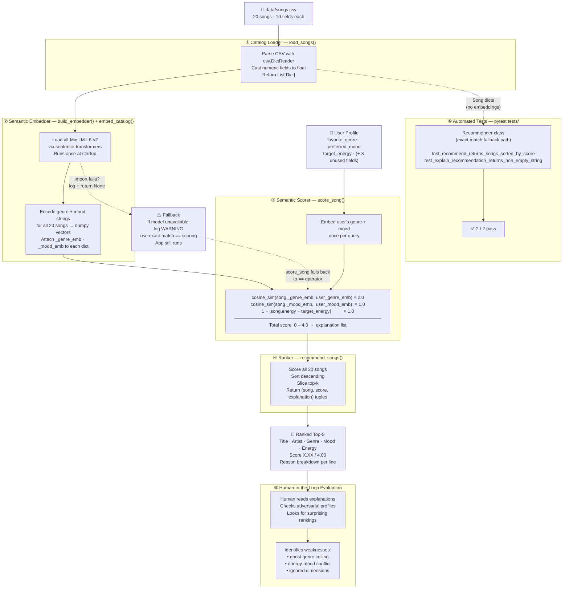

# System Diagram

Render in any Mermaid-compatible viewer, VS Code preview, the [Mermaid Live Editor](https://mermaid.live), or GitHub (which renders Mermaid fences natively).

## Component Summary

| # | Component | Function | Key file |
|---|---|---|---|
| ① | Catalog Loader | Parses CSV → typed dicts | `src/recommender.py · load_songs()` |
| ② | Semantic Embedder | Loads model, pre-computes song vectors | `src/recommender.py · build_embedder(), embed_catalog()` |
| ③ | Semantic Scorer | Cosine similarity replaces `==` for genre/mood | `src/recommender.py · score_song()` |
| ④ | Ranker | Sorts scored songs, returns top-k with explanations | `src/recommender.py · recommend_songs()` |
| ⑤ | Human-in-the-loop | Reads output, judges quality, identifies failure modes | `src/main.py` prints; human inspects |
| ⑥ | Test Suite | Validates sort order and explanation format via fallback path | `tests/test_recommender.py` |
